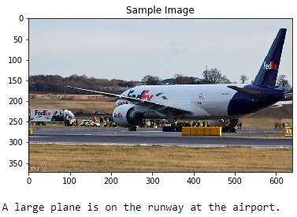
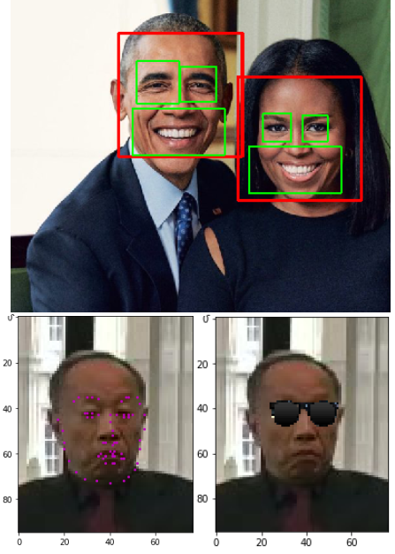

# Computer Vision Nanodegree 

This repository contains the projects that I've developed during Udacity's [Computer Vision Nanodegree](https://www.udacity.com/course/computer-vision-nanodegree--nd891).

## Projects

### [Facial_Keypoints Detection](https://github.com/HROlive/Computer-Vision-Nanodegree/tree/master/project_1-facial_keypoint%20_detection)

Using image processing and deep learning techniques to create a facial keypoint detection system that takes in any image with faces, and predicts the location of 68 distinguishing keypoints on each face, such as the position of the eyes, nose, and mouth.

### Automatic Image Captioning

Designed and trained a CNN-RNN model that automatically generates image captions. The network is trained on the Microsoft Common Objects in COntext (MS COCO) dataset. The image captioning model is displayed below.

### Landmark Detection & Robot Tracking (SLAM)

Implementation of SLAM (Simultaneous Localization and Mapping) for a 2-dimensional world. Sensor and motion data gathered by a simulated robot is used to create a map of an environment. SLAM gives us a way to track the location of a robot in the world in real-time and identify the locations of landmarks such as buildings, trees, rocks, etc.
